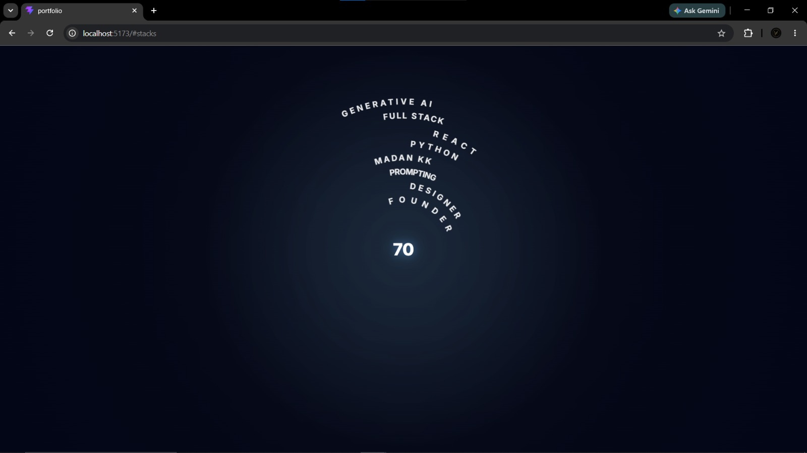
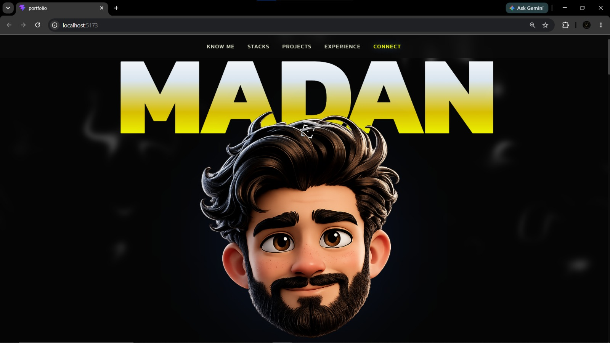
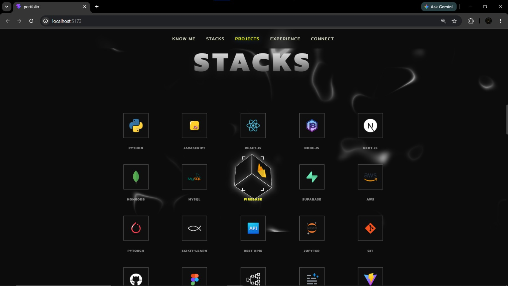
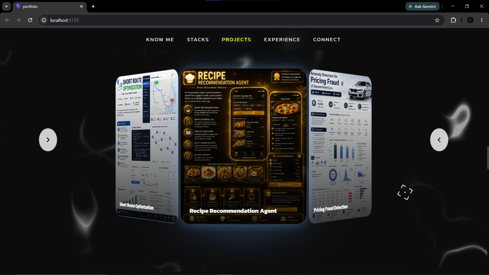
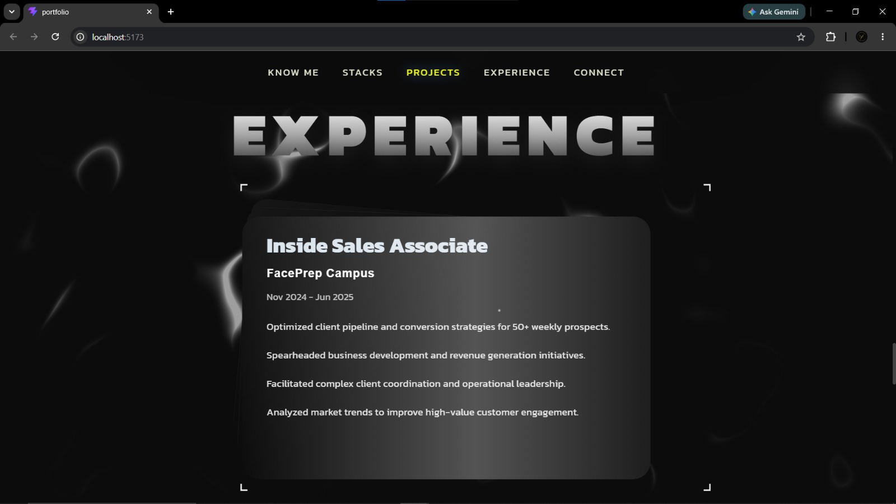
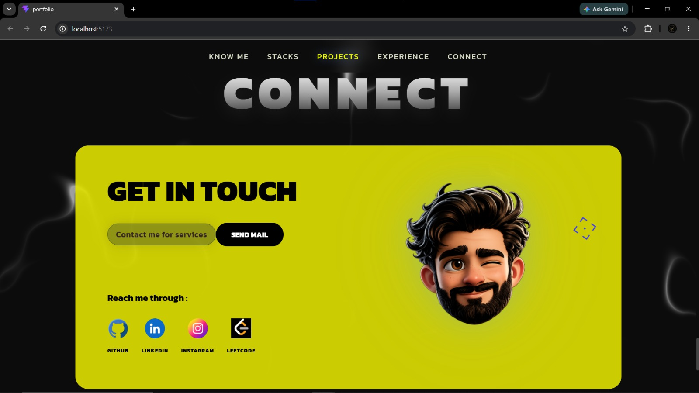

# 🚀 Madan KK Portfolio

A modern, interactive, and fully responsive developer portfolio built to showcase my work in Full Stack Development, Generative AI, Machine Learning, and UI/UX Design.

Designed with a strong focus on user experience, smooth animations, physics-based interactions, and premium visual aesthetics, this portfolio serves as both a professional showcase and a playground for experimenting with modern frontend technologies.

---

## 🌐 Live Demo

🔗 Portfolio Website: https://madan-portfolio-orcin.vercel.app/

🔗 GitHub Repository: https://github.com/Madankk-06/madan-portfolio

---

## 📌 Overview

This portfolio was built from scratch using React and Vite with the goal of creating an immersive browsing experience rather than a traditional static portfolio.

Every section was carefully designed to provide smooth interactions, engaging visuals, and intuitive navigation while maintaining performance and responsiveness across devices.

The project combines modern frontend development practices with advanced UI animations and interactive components to create a memorable user experience.

---

# ✨ Features

### 🎯 Hero Section

- Large animated typography
- Magnetic avatar interaction
- Custom cursor support
- Smooth entrance animations
- Resume download functionality

### 👨‍💻 About Section

- Professional introduction
- Career overview
- Modern typography styling
- Smooth reveal animations

### 🧩 Interactive Skills Section

- Physics-based 3D skill cubes
- Wave-like hover interactions
- Dynamic technology showcase
- Responsive layout

### 🚀 Projects Showcase

- Interactive cylindrical 3D project carousel
- Hover effects and glow animations
- Dynamic project information panel
- Smooth transitions between projects

### 💼 Experience Section

- Professional experience timeline
- Animated stack cards
- Smooth scroll interactions

### 🏆 Achievements Section

- Animated statistics cards
- Modern glassmorphism styling
- Responsive design

### 📬 Contact Section

- Professional contact form
- Social media integration
- Interactive UI components
- Custom illustrated profile section

### 🦶 Footer

- Professional navigation links
- Social connections
- Technology stack overview

---

# 🎨 Interactive Elements

This portfolio includes several advanced UI interactions:

✅ Custom Target Cursor

✅ Magnetic Avatar Effects

✅ Physics-Based Hover Animations

✅ Scroll Progress Indicator

✅ Smooth Scroll Reveal Animations

✅ Dynamic Project Carousel

✅ Interactive Skill Cubes

✅ Glassmorphism Effects

✅ Gradient Typography

✅ Micro-interactions Throughout

---

# 🛠️ Tech Stack

## Frontend

- React.js
- Vite
- JavaScript (ES6+)
- CSS3

## Animation & Interaction

- Framer Motion
- Custom Cursor Effects
- Physics-Based Hover Interactions

## UI/UX

- Responsive Design
- Glassmorphism
- Modern Gradients
- Interactive Components

## Development Tools

- Git
- GitHub
- VS Code

---

# 📂 Project Structure

```bash
src/
│
├── assets/
│   ├── avatar/
│   ├── projects/
│   ├── skills/
│   ├── contact/
│   └── resume/
│
├── components/
│   ├── Hero.jsx
│   ├── About.jsx
│   ├── Skills.jsx
│   ├── Projects.jsx
│   ├── Experience.jsx
│   ├── Stats.jsx
│   ├── Contact.jsx
│   ├── Footer.jsx
│   ├── Navbar.jsx
│   └── ...
│
├── data/
│   └── portfolioData.js
│
├── styles/
│   └── globals.css
│
├── App.jsx
└── main.jsx
```

---

# 🖼️ Screenshots

## Loader Section



## Hero Section



---

## Skills Section



---

## Projects Carousel



---

## Experience Section



---

## Contact Section



---

# 🚀 Featured Projects

## 🏠 MK Homes Smart UI

Smart home dashboard featuring:

- AI chatbot
- Real-time power monitoring
- Appliance control system
- Responsive user experience

---

## 🗺️ Route Optimization System

Implemented shortest-path prediction using:

- Dijkstra's Algorithm
- NetworkX
- Streamlit
- Google Maps Integration

---

## 🍳 Recipe Recommendation Agent

Real-time recipe recommendation platform:

- Ingredient-based suggestions
- Smart shopping list generation
- Multi-cuisine support

---

## 🚗 Car Pricing Fraud Detection

Machine Learning project for identifying pricing anomalies:

- Isolation Forest
- LOF
- DBSCAN
- Elliptic Envelope

Dataset Size:

- 50,000+ records

---

## 🎯 Optimal Action Preparation System

Productivity-focused UI/UX project:

- High-fidelity Figma prototype
- Goal planning workflows
- Progress tracking

---

## 📰 Technical Lifestyle Magazine

Designed and published a technology magazine featuring:

- Cybersecurity
- AI
- Software Development
- Analytics

---

# 📈 Performance Goals

- Fully Responsive Design
- Optimized Asset Loading
- Smooth User Interactions
- Scalable Component Architecture
- Cross-Device Compatibility

---

# 🔧 Installation

Clone the repository:

```bash
git clone https://github.com/Madankk-06/madan-portfolio.git
```

Navigate to the project:

```bash
cd madan-portfolio
```

Install dependencies:

```bash
npm install
```

Start development server:

```bash
npm run dev
```

Build for production:

```bash
npm run build
```

Preview production build:

```bash
npm run preview
```

---

# 🎯 Future Improvements

- SEO Optimization
- Blog Integration
- Dark/Light Theme Toggle
- Project Filtering
- Analytics Dashboard
- Enhanced 3D Interactions
- AI-Powered Portfolio Assistant

---

# 👨‍💻 Author

### Madan KK

Full Stack Developer | Generative AI Enthusiast | UI/UX Designer

📧 Email: madankumar06052003@gmail.com

🔗 LinkedIn: https://linkedin.com/in/madankk06

🔗 GitHub: https://github.com/Madankk-06

---

# ⭐ Support

If you found this project useful or inspiring, consider giving it a star ⭐ on GitHub.

It helps others discover the project and supports my work.

---

## Built with ❤️ by Madan KK