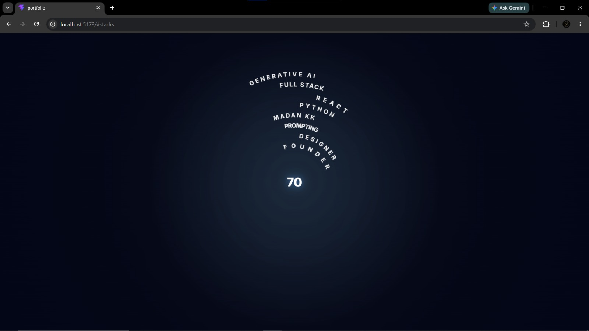
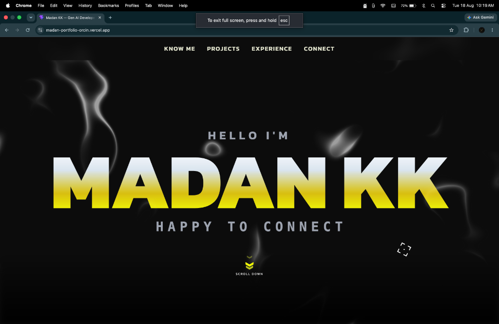
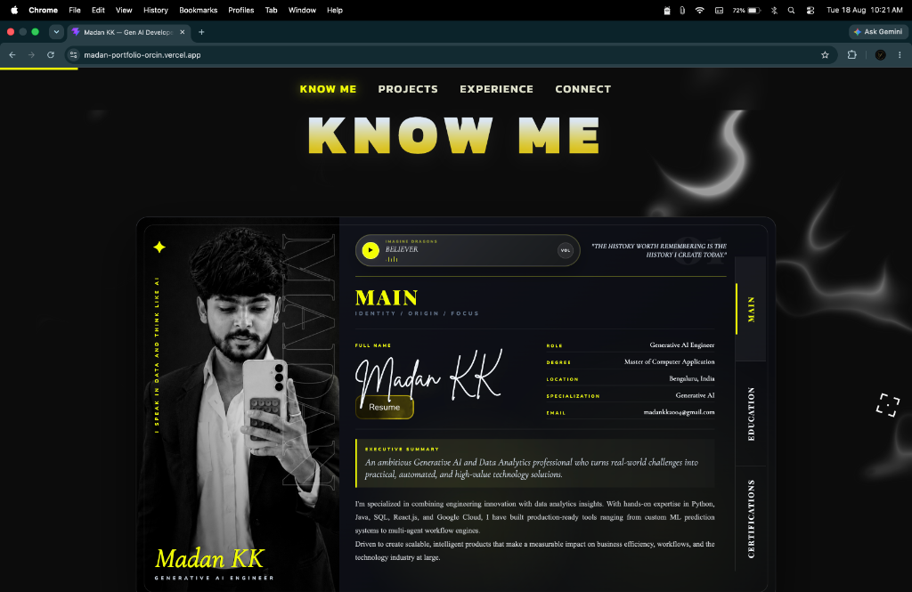
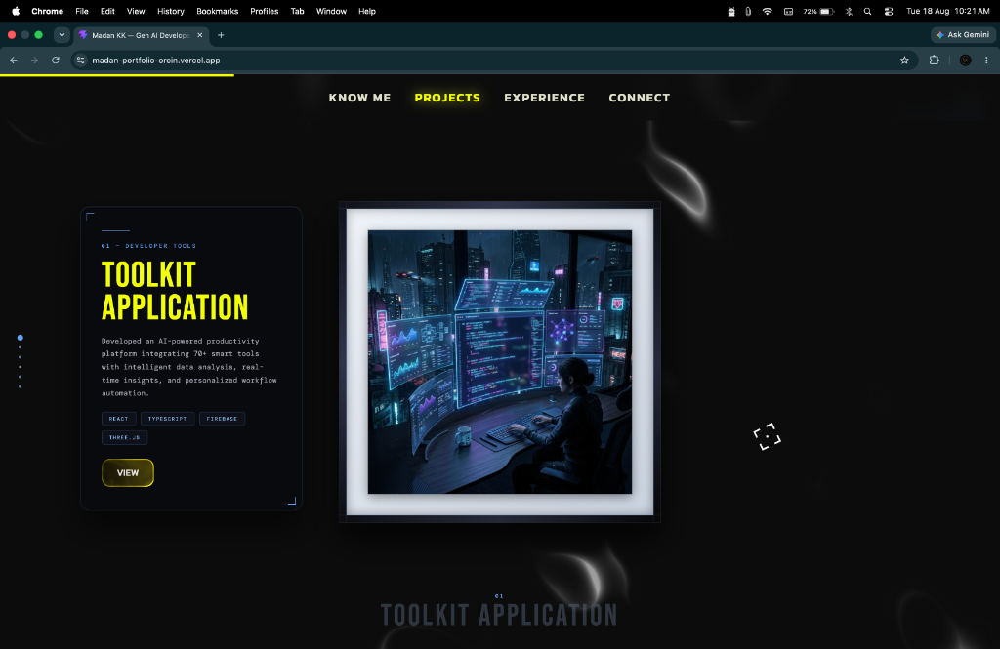
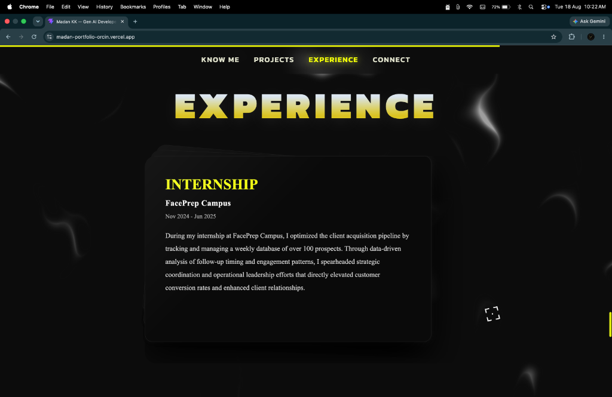
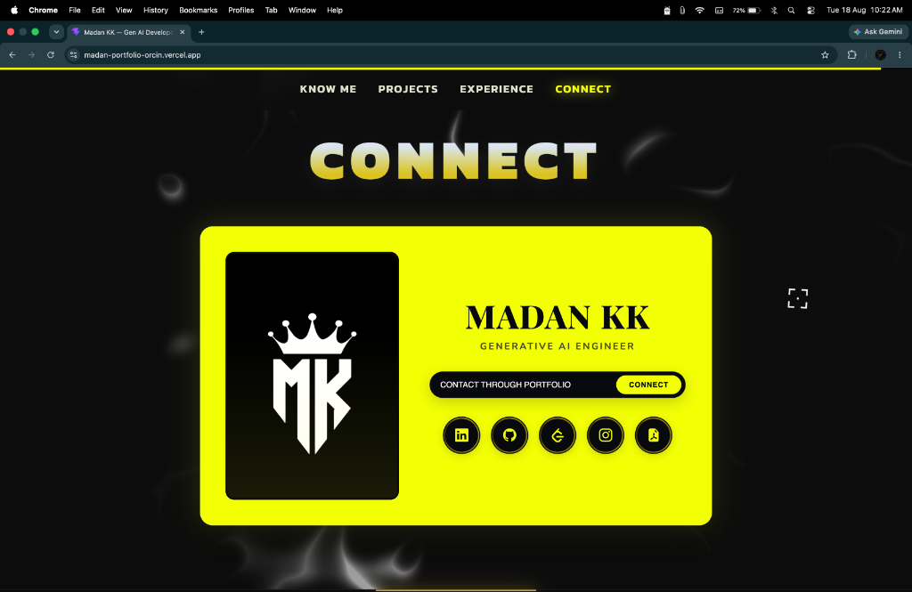

# 🚀 Madan KK Portfolio

A modern, interactive, and fully responsive developer portfolio built to showcase my work in **Generative AI, Full Stack Development, Data Analytics, Machine Learning, and UI/UX Design**.

Designed with a focus on immersive user experiences, smooth 3D animations, physics-based interactions, and a luxury dark/gold cyberpunk aesthetic.

---

## 🌐 Live Demo

- **🔗 Live Portfolio**: [https://madan-portfolio-orcin.vercel.app/](https://madan-portfolio-orcin.vercel.app/)
- **🔗 GitHub Repository**: [https://github.com/Madankk-06/madan-portfolio](https://github.com/Madankk-06/madan-portfolio)

---

## 📌 Overview

This portfolio is crafted from the ground up using **React**, **Vite**, **Framer Motion**, and **WebGL** shaders. Rather than a conventional static CV website, it delivers an engaging, tactile journey through my engineering work, technical skillset, professional experience, and academic milestones.

---

# ✨ Core Features & Sections

### 🎯 1. Hero Section
- Dynamic split-flap mechanical text flipping animation (**"HAPPY TO CONNECT"**).
- Ultra-bold gradient typography with golden glow.
- Interactive custom **Target Cursor** with smart corner brackets.
- Ambient WebGL **Ferrofluid** fluid particle background that reacts smoothly to user movement.
- Smooth scroll-down navigation indicator.

### 👤 2. Know Me Section (Interactive Dossier)
- Cyberpunk-inspired multi-tab executive dossier card.
- Built-in interactive audio player widget with ambient track selection.
- Multi-tab navigation:
  - **MAIN**: Full identity, Executive Summary, quick resume download, and core focus.
  - **EDUCATION**: Master of Computer Applications (MCA) & academic foundation.
  - **CERTIFICATIONS**: Categorized domains across Generative AI & Deep Learning, Data Science & Analytics, Software Engineering, Front-End & UI/UX, and Digital Marketing with direct verification links.

### 🚀 3. Projects Showcase (3D Cube Gallery & Browse More)
- **3D Cube Gallery**: A 3D cube scene that rotates through flagship applications as the user scrolls.
- Synchronized project details panel with live tech tags, descriptions, and direct GitHub links.
- **Browse More Grid**: Full catalog of projects powered by dynamic **PixelCard** canvas animations that reveal the project upon interaction.

### 💼 4. Experience Section (3D Stack Deck)
- 3D swipeable card stack deck with physics-based drag and click interactions.
- Smooth Framer Motion spring physics with swipe-to-back cycling.
- High-contrast dark styling with sweeping metallic reflection sheens and editorial typography.

### 🏆 5. Achievements & Statistics
- Key performance metrics showcasing certifications, coding milestones, and delivered projects.
- High-contrast glassmorphic card design.

### 📬 6. Connect Section (3D Tilt Contact Card)
- 3D mouse-tracking interactive tilt card.
- Direct-action email contact input trigger.
- One-click links to **LinkedIn**, **GitHub**, **LeetCode**, **Instagram**, and **Resume PDF**.

---

# 🎨 Interactive & Visual Highlights

- ✅ **Custom Target Cursor** with active bounding box locking.
- ✅ **WebGL Ferrofluid Fluid Particles** dynamic background.
- ✅ **3D Perspective Scroll Cube** for project showcases.
- ✅ **Physics-Based Card Stacking Deck** with gesture dragging.
- ✅ **Pixel-Canvas Hover Effects** on secondary project cards.
- ✅ **Split-Flap Mechanical Character Flip** typography.
- ✅ **Glassmorphic Multi-Tab Dossier** interface.
- ✅ **Adaptive Mobile-Responsive Layouts** across all screen sizes.

---

# 🛠️ Tech Stack

### Frontend & Core
- **React 18** — Component architecture & state management
- **Vite** — High-speed build tooling and bundling
- **JavaScript (ES6+)** — Modern asynchronous logic
- **CSS3 / PostCSS** — Custom dark-theme styling, glassmorphism, 3D transforms

### Animation & 3D
- **Framer Motion** — Spring physics, layout animations, and gesture tracking
- **HTML5 Canvas & WebGL** — Interactive pixel grids and fluid shaders

### Development & Deployment
- **Git & GitHub** — Version control and collaborative workflows
- **Vercel** — Automated continuous deployment and edge hosting

---

# 📂 Project Structure

```bash
src/
├── assets/
│   ├── avatar/       # Profile photos, 3D avatars, and headshots
│   ├── contact/      # Social icons and contact assets
│   ├── logo/         # Personal brand logo (MK)
│   ├── projects/     # Flagship project showcase preview images
│   ├── resume/       # PDF resume download file
│   └── skills/       # Technology and framework logos
│
├── components/
│   ├── About.jsx             # Know Me section container
│   ├── Contact.jsx           # 3D interactive Connect card
│   ├── DossierCard.jsx       # Multi-tab dossier card with certs & audio
│   ├── Experience.jsx        # Experience container
│   ├── ExperienceStack.jsx   # 3D Framer Motion card stack component
│   ├── FerrofluidBackground.jsx # WebGL fluid particle background
│   ├── Hero.jsx              # Hero section with split-flap typography
│   ├── Loader.jsx            # Animated intro loading screen
│   ├── Navbar.jsx            # Floating header navigation bar
│   ├── PixelCard.jsx         # Interactive pixel-grid canvas card
│   ├── Projects.jsx          # 3D project cube & Browse More grid
│   ├── ScrollProgress.jsx    # Top scroll progress bar
│   ├── SplitFlapText.jsx     # Mechanical text flip animator
│   ├── Stats.jsx             # Key metrics & achievements
│   └── TargetCursor.jsx      # Custom crosshair target cursor
│
├── data/
│   └── portfolioData.js      # Central data source for skills & bio
│
├── styles/
│   └── globals.css           # Global CSS variables, animations & layout
│
├── App.jsx                   # Application root composition
└── main.jsx                  # React DOM entry point
```

---

# 🖼️ Screenshots

## Loader Section


---

## Hero Section


---

## Know Me Section


---

## Projects Showcase


---

## Experience Section


---

## Connect Section


---

# 🚀 Featured Projects

### 🛠️ Toolkit Application
AI-powered developer productivity platform integrating 70+ intelligent tools with workflow automation, real-time analytics, and data processing.
- **Tech**: React, TypeScript, Firebase, Three.js

### 🗺️ Last-Mile Routing Analyst
Shortest-path graph optimization over road networks using Dijkstra's algorithm and Google Maps API visualization.
- **Tech**: Python, Streamlit, NetworkX, Google Maps API

### 🚗 Price Anomaly Detector
Machine learning system for detecting fraudulent and anomalous used vehicle listings across 50K+ records using unsupervised anomaly detection models.
- **Tech**: Python, Pandas, Scikit-learn, Isolation Forest, DBSCAN

### 💬 YouTube Opinion & Vibe Checker
End-to-end NLP data pipeline extracting comments via API, storing in MySQL, and classifying sentiment trends and audience sentiment.
- **Tech**: Python, YouTube Data API v3, NLTK, MySQL

### ✍️ Bank Cheque Signature Audit System
Computer vision and deep learning authentication tool verifying signatures on bank cheques to detect forgery.
- **Tech**: Python, OpenCV, Deep Learning

### 🌐 EchoLingo Realtime Translator
Offline voice and text translation application with customized voice synthesis and glassmorphic UI.
- **Tech**: Java, Neural Opus-MT, Android SDK

---

# 🔧 Local Installation & Setup

1. **Clone the repository**:
   ```bash
   git clone https://github.com/Madankk-06/madan-portfolio.git
   ```

2. **Navigate to the project directory**:
   ```bash
   cd madan-portfolio
   ```

3. **Install dependencies**:
   ```bash
   npm install
   ```

4. **Start the local development server**:
   ```bash
   npm run dev
   ```

5. **Build for production**:
   ```bash
   npm run build
   ```

6. **Preview production build**:
   ```bash
   npm run preview
   ```

---

# 👨‍💻 Author

**Madan KK**  
*Generative AI Engineer | Full Stack Developer*

- 🌐 **Portfolio**: [madan-portfolio-orcin.vercel.app](https://madan-portfolio-orcin.vercel.app/)
- 💼 **LinkedIn**: [linkedin.com/in/madankk04122004](https://linkedin.com/in/madankk04122004)
- 🐙 **GitHub**: [github.com/Madankk-06](https://github.com/Madankk-06)
- 🧠 **LeetCode**: [leetcode.com/u/madankk-04122004](https://leetcode.com/u/madankk-04122004/)
- 📧 **Email**: [madankk2004@gmail.com](mailto:madankk2004@gmail.com)

---

⭐ **If you like this project, feel free to star the repository!**
